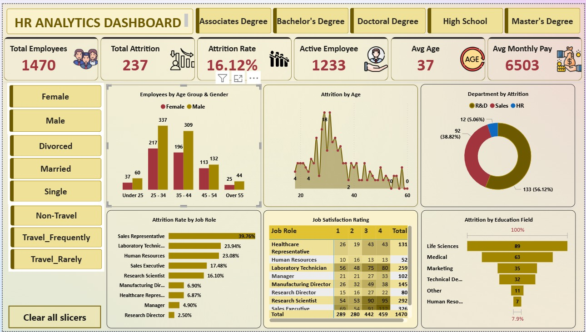

# HR Analytics Dashboard

## Project Overview

This project presents an interactive HR Analytics Dashboard designed to analyze employee workforce data, attrition patterns, employee demographics, job roles, education, and job satisfaction.

The dashboard provides an overview of key HR metrics and allows users to explore employee and attrition trends using interactive filters.

## Tools Used

- Power BI
- Microsoft Excel
- Power Query
- DAX

## Key HR Metrics

The dashboard provides the following key metrics:

- Total Employees: 1,470
- Total Attrition: 237
- Attrition Rate: 16.12%
- Active Employees: 1,233
- Average Age: 37
- Average Monthly Pay: 6,503

## Dashboard Analysis

### Employee Demographics

The dashboard analyzes employees by:

- Age group
- Gender
- Education level
- Marital status

### Attrition Analysis

The dashboard provides insights into:

- Attrition by age
- Attrition by department
- Attrition rate by job role
- Attrition by education field

### Job Satisfaction

The dashboard includes a job satisfaction analysis by job role, showing satisfaction ratings from 1 to 4.

### Interactive Filters

Users can filter the dashboard based on:

- Education level
- Gender
- Marital status
- Business travel category

## Key Insights

- The dashboard contains 1,470 employees, with 237 employees recorded under attrition.
- The overall attrition rate is 16.12%.
- There are 1,233 active employees.
- The average employee age is 37 years.
- Average monthly pay is 6,503.
- Sales Representative has the highest attrition rate among the displayed job roles.
- Research & Development has the highest number of employees among the departments shown in the attrition analysis.
- Employee attrition and job satisfaction can be analysed across different job roles and education fields.

## Dashboard Preview

## Project Files

- `HR_Analytics_Dashboard.pbix` – Power BI dashboard
- `Company_Employee_Data.xlsx` – Excel source/data file
- `HR_ANALYTICS_DASHBOARD_REPORT.jpg` – Dashboard preview

## Project Objective

The objective of this project is to use HR data visualisation and analysis to understand workforce characteristics, identify attrition patterns, and provide meaningful HR insights through an interactive Power BI dashboard.