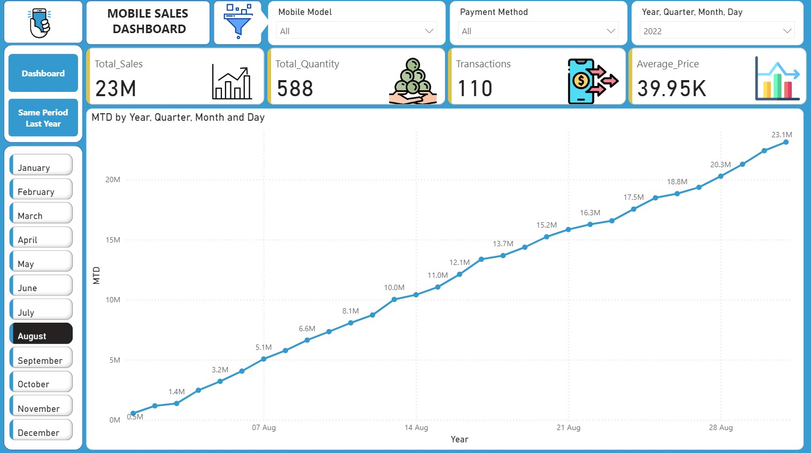

# Mobile Sales Dashboard

## Project Overview
This project analyzes mobile sales data and provides insights through an interactive Power BI dashboard.

## Tools Used
- Power BI
- Excel
- Data Cleaning
- Data Visualization

## Analysis Performed
- Sales performance analysis
- Revenue trends
- Product-wise analysis
- Customer insights

## Key Insights
- Identified top-performing mobile brands
- Analyzed monthly sales trends
- Compared revenue performance

## Dashboard Preview

## Dashboard Preview

## Dashboard Preview

### Main Dashboard

### MTD Report

### Same Period Last Year Report
